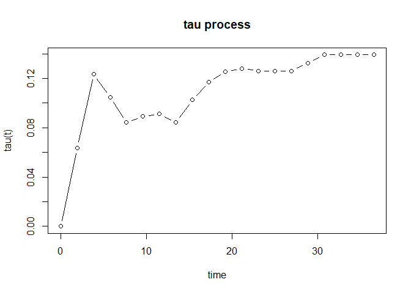

<!-- README.md is generated from README.Rmd. Please edit that file -->

# tauProcess

<!-- badges: start -->
<!-- badges: end -->

In clinical trials, the non-proportional hazard (NPH) scenarios are
commonly encountered. The classical hazard ratio is no longer a
meaningful treatment effect measure. Furthermore, the commonly used
logrank test may lose its power under NPH. Several effect measures and
testing procedures are proposed to overcome these problems, including
weighted logrank, restricted mean survival time (RMST) and maxcombo
tests. The local Kendall’s tau measure we proposed is intuitive and
clinically meaningful. The inference procedure based on local Kendall’s
tau is also provided.

## Installation

You can install the development version of tauProcess from
[GitHub](https://github.com/) with:

``` r
# install.packages("devtools")
devtools::install_github("s07308/tauProcess")
```

## Usage

## Example

This is a basic example which shows you how to fit a tau process:

``` r
library(tauProcess)
## basic example code
fit <- tau.fit(data = Inotuzumab)
```

You may use `summary()` to check the statistical inference results:

``` r
summary(fit)
#>  N0= 162  N1= 164  The truncation time is specified as 36.53365 
#> 
#> Random grouping design:
#>     tau  se(R) z(R) Pr(>|z|) (R)  
#>  0.1391 0.0655 2.12        0.034 *
#> 
#> Fixed grouping design:
#>     tau  se(F) z(F) Pr(>|z|) (F)  
#>  0.1391 0.0655 2.12        0.034 *
#> ---
#> Signif. codes:  0 '***' 0.001 '**' 0.01 '*' 0.05 '.' 0.1 ' ' 1
#> 
#>     tau lower .95(R) upper .95(R) lower .95(F) upper .95(F)
#>   0.139       0.0107        0.268       0.0107        0.268
```

Furthermore, `plot()` will provide you the estimated tau process to
investigate the evolution of treatment effect.

``` r
plot(fit)
```


