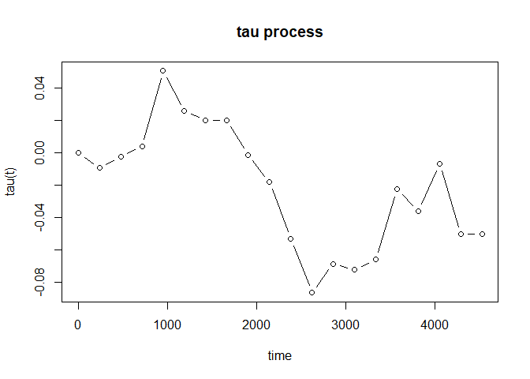
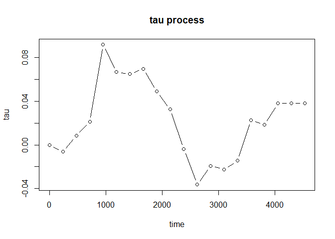

<!-- README.md is generated from README.Rmd. Please edit that file -->

# tauProcess

<!-- badges: start -->
<!-- badges: end -->

In clinical trials, nonproportional hazard (NPH) scenarios are commonly
encountered. In such cases, the classical hazard ratio no longer serves
as a meaningful treatment effect measure. Furthermore, the commonly-used
logrank test may lose its power. To address these challenges, several
treatment effect measures and testing procedures have been proposed,
including weighted logrank, restricted mean survival time (RMST), and
maxcombo tests. The proposed tau measures/processes are intuitive and
clinically meaningful, in line with the requirements outlined in the
addendum to ICH E9, which places emphasis on the interpretability of the
estimand. For details, please refer to Tai, Wang and Wells (2023)
<https://doi.org/10.1002/pst.2324>.

In immuno-oncology trials, it is often observed that Kaplan-Meier curves
exhibit plateaus. This indicates the presence of a cure fraction or
long-term survivors in the population. The mixture cure framework allows
for separating the treatment effects on the cure fractions and the
susceptible subgroups. Subsequently, this package also provides a
function which can produce a tau process designed to measure the
treatment effect over time for the susceptible subgroups. The cure rate
for each group is estimated by the tail value of the Kaplan-Meier
estimator.

## Installation

You can install the development version of tauProcess from
[GitHub](https://github.com/) with:

``` r
# install.packages("devtools")
devtools::install_github("s07308/tauProcess")
```

## Usage & Example

This is a basic example which shows you how to estimate the tau process
and make the corresponding statistical inference:

``` r
library(tauProcess)
fit <- tau.fit(data = pbc)
```

You may use `summary()` to check the inference results at the largest
time specified:

``` r
summary(fit)
#>  N0= 131  N1= 127  The truncation time is specified as 4523 
#> 
#> Random grouping design:
#>      tau   se(R)  z(R) Pr(>|z|) (R)
#>  -0.0503  0.0906 -0.55         0.58
#> 
#> Fixed grouping design:
#>      tau   se(F)  z(F) Pr(>|z|) (F)
#>  -0.0503  0.0906 -0.55         0.58
#> 
#>       tau lower .95(R) upper .95(R) lower .95(F) upper .95(F)
#>   -0.0503       -0.228        0.127       -0.228        0.127
```

Furthermore, `plot()` will provide you the estimated tau process to
investigate the evolution of treatment effect:

``` r
plot(fit, type = "b")
```



For the case with possibly existing cure fraction, we may estimate the
tau process for the susceptible subgroups:

``` r
fit_cure <- tau_proc(pbc, cure = TRUE)
```

<br> **Bootstrap** <br> The bootstrap method is recommended to make
statistical inference about the tau process for susceptible subgroups.
For given time point $t$, we may make an inference on $\tau_a(t)$. The
p-value with respect to the null $H_0: \tau_a(t) = 0$ may be calculated
by the following steps:

``` r
# install.packages("boot")
library(boot)

boot_fun <- function(data, indices, t) {
  d <- data[indices, ]
  tau_fit <- tau_proc(d, t = t, cure = TRUE)
  
  tau_fit$vals_tau_proc
}

num_boot <- 5000
t <- 1000

boot_results <- boot(pbc, statistic = boot_fun, t = t, R = num_boot, strata = pbc$arm)
sd_est <- sd(boot_results$t)

pchisq((boot_results$t0 / sd_est) ^ 2, df = 1, lower.tail = FALSE)
#> [1] 0.2729425
```

Under sufficient follow-up $\hat{\tau}_a(t)$ can be treated as
$\hat{\tau}_a$, where $t = X_{(n_0)} \wedge X_{(n_1)}$. The p-value with
respect to the null $H_0: \tau_a = 0$ may be calculated by the following
steps:

``` r
# install.packages("boot")
library(boot)

boot_fun <- function(data, indices) {
  d <- data[indices, ]
  tau_fit <- tau_proc(d, cure = TRUE)
  
  tail(tau_fit$vals_tau_proc, 1)
}

num_boot <- 5000

boot_results <- boot(pbc, statistic = boot_fun, R = num_boot, strata = pbc$arm)
sd_est <- sd(boot_results$t)

pchisq((boot_results$t0 / sd_est) ^ 2, df = 1, lower.tail = FALSE)
#> [1] 0.7986194
```

As the case with no cure fraction, we may plot the estimated tau process
as well:

``` r
plot(fit_cure, type = "b")
```


