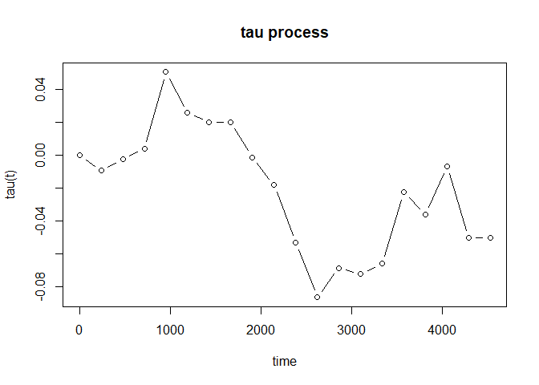

<!-- README.md is generated from README.Rmd. Please edit that file -->

# tauProcess

<!-- badges: start -->
<!-- badges: end -->

Non-proportional hazard (NPH) scenarios are common in clinical trials.
Under NPH, the commonly used log-rank test may lose power, and the
hazard ratio may no longer be a meaningful measure of treatment effect.
The proposed tau process adheres to the addendum to ICH E9, which
emphasizes the use of an Estimand defined as “a precise description of
the treatment effect reflecting the clinical question posed by a given
clinical trial objective.” At each failure time in one group, the
survival probability of the other group at that time is calculated and
compared. The tau process sums over the differences in probabilities up
to time t, providing an intuitive visual aid for assessing the
cumulative treatment effect over time. An increasing trend of tau(t) in
some interval of t indicates that Group 1 consistently shows its
efficacy during this time period. When tau(t) is positive, subjects in
Group 1 have longer survival compared to those in Group 0 up to time t.

## Installation

You can install the development version of tauProcess from
[GitHub](https://github.com/) with:

``` r
# install.packages("devtools")
devtools::install_github("s07308/tauProcess")
```

## Usage & Example

This is a basic example which shows you how to estimate the tau process
and make the corresponding statistical inference:

``` r
library(tauProcess)
fit <- tau.fit(data = pbc)
```

You may use `summary()` to check the inference results at the largest
time specified:

``` r
summary(fit)
#>  N0= 131  N1= 127  The truncation time is specified as 4523 
#> 
#> Random grouping design:
#>      tau   se(R)  z(R) Pr(>|z|) (R)
#>  -0.0503  0.0906 -0.55         0.58
#> 
#> Fixed grouping design:
#>      tau   se(F)  z(F) Pr(>|z|) (F)
#>  -0.0503  0.0906 -0.55         0.58
#> 
#>       tau lower .95(R) upper .95(R) lower .95(F) upper .95(F)
#>   -0.0503       -0.228        0.127       -0.228        0.127
```

Furthermore, `plot()` will provide you the estimated tau process to
investigate the progression of treatment effect:

``` r
plot(fit, type = "b")
```


